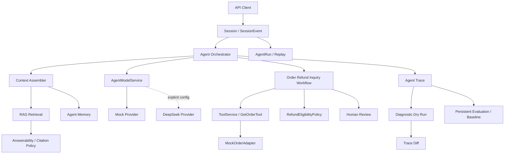

# TravelCare Agent

> 面向旅行客服场景的受控 Agent 后端：模型负责理解与表达，后端负责事实、规则、执行、追踪和评测。

## 项目定位

TravelCare Agent 是一个基于 Spring Boot 的模块化单体后端项目。它围绕“订单退款咨询”构建了一条可运行的 AI 客服链路，并把会话、RAG、Memory、确定性工作流、工具调用、异步任务、人工复核、执行追踪、诊断回放和离线评测组织为可持久化的工程闭环。

这个项目当前可以准确描述为：

- **受控 Agent 后端**：存在 Orchestrator、Prompt、Provider 和工具调用，但不是让模型自主规划并直接执行敏感动作。
- **具备最小 RAG 闭环**：支持知识导入、分块、检索、Answerability 判断和 Citation Policy；检索采用 MySQL FULLTEXT/LIKE，不是向量 RAG。
- **默认 Mock、可选 DeepSeek**：真实 Provider Adapter 已实现，但默认配置和全量测试固定使用 Mock，不宣称已完成生产级真实模型验证。
- **按生产问题设计的学习项目**：具备幂等、审计、异步恢复、Trace、Dry Run、Diff 和 Evaluation，但没有真实供应商、支付或退款执行能力。

核心原则：**LLM 提议，后端验证、授权、执行、持久化并审计。**

## 核心业务链路



订单状态来自 `OrderAdapter`，退款资格由 `RefundEligibilityPolicy` 基于结构化订单事实判断。RAG、Memory 和 LLM 可以增强解释与表达，但不能覆盖退款结论，也不能直接触发退款、支付、取消或改签。

## 技术栈

- Java 17、Spring Boot 3.3.4
- MyBatis-Plus、MySQL 8、Flyway
- Redis、RabbitMQ
- JUnit 5、Spring Boot Test、Mockito
- DeepSeek OpenAI-compatible Chat Completions API（可选）
- Mermaid、Markdown Evaluation Report

## 已实现能力

| 领域 | 当前能力 | 关键实现 |
| --- | --- | --- |
| Conversation | 创建会话、顺序事件流、上下文读取 | `SessionService`、`SessionEventService` |
| Workflow | 退款咨询工作流、步骤和任务持久化 | `WorkflowEngine`、`OrderRefundInquiryWorkflow` |
| Tool / Policy | 工具生命周期、订单查询、确定性退款规则 | `ToolService`、`GetOrderTool`、`RefundEligibilityPolicy` |
| Reliability | 幂等键、请求 hash、Redis Lock、异步重试 | `IdempotencyService`、`WorkflowTaskWorker` |
| RAG | 文档导入、段落分块、有效期过滤、FULLTEXT/LIKE 检索 | `KnowledgeIngestionService`、`RetrievalService` |
| Answerability | 可回答性判断、引用准入、低质量证据拒绝、Fallback | `AnswerabilityService`、`CitationPolicy` |
| Memory | 用户偏好和行程上下文 | `MemoryService` |
| Agent | 固定编排、Prompt 版本、Mock/DeepSeek Provider | `AgentOrchestrator`、`AgentModelService` |
| Human Review | Case 创建、分配、处理和工作流恢复 | `HumanReviewService` |
| Audit | 关键业务动作及 evidence 持久化 | `AuditService` |
| AgentRun | 模型调用和回复上下文追踪 | `AgentRunService` |
| Replay | 按 AgentRun 只读聚合历史事实 | `AgentRunReplayService` |
| Trace | Run、Span、Event、Snapshot 和诊断聚合 | `TraceService`、`TraceQueryService` |
| Dry Run / Diff | 基于脱敏快照的无副作用模拟和差异分析 | `DiagnosticDryRunService`、`TraceDiffService` |
| Evaluation | Dataset、Case、Run、Scorer、Report、Baseline Regression | `EvaluationRunnerService`、`BaselineComparisonService` |

## 阶段演进

| 阶段 | 已完成内容 |
| --- | --- |
| Stage 1 | Session/Event、订单查询、退款咨询 Workflow、Tool Call、幂等、审计最小闭环 |
| Stage 2 | 持久化 Workflow Task、RabbitMQ Worker、Redis Lock、Human Review、失败重试 |
| Stage 3 | 知识导入与检索、Memory、上下文组装、RAG/Memory 业务边界 |
| Stage 4 | AgentRun、只读 Replay、JUnit Golden Cases 和本地 Evaluation Report |
| Stage 5 | Provider 抽象、Mock/DeepSeek 切换、Prompt 版本、模型调用追踪和安全降级 |
| Stage 6 | README、架构定位和面试表达收口，明确能力与非能力边界 |
| Stage 7 | Agent Execution Trace、诊断聚合、Snapshot、Diagnostic Dry Run 和 Trace Diff |
| Stage 8 | 持久化 Evaluation Dataset/Case/Run、确定性 Scorer、Baseline Promotion 和 Regression Comparison |
| Stage 9 | RAG Answerability Gate、结构化 Citation、拒绝原因和 RAG 质量评测 Scorer |

## RAG 与 Answerability

知识导入接口将文本按段落写入 `knowledge_documents` 和 `knowledge_chunks`。检索优先使用 MySQL FULLTEXT，零结果时回退到 LIKE 匹配，并过滤文档状态和有效期。

Stage 9 在“检索命中”与“允许回答”之间增加了 Answerability Gate：

1. `RetrievalService` 返回带 `retrievalRunId`、chunk、document、source URI、有效期和 score 的候选证据。
2. `AnswerabilityService` 检查证据是否属于当前检索、是否过期、分数是否达到阈值。
3. `CitationPolicy` 给出 `REQUIRED`、`OPTIONAL` 或 `FORBIDDEN`。
4. 无证据、低匹配或过期证据进入确定性 Fallback，不把未经验证的内容交给模型自由发挥。
5. 已锁定的退款等业务结论禁止由 Citation 改写；RAG 最多解释结论。

当前 RAG 的边界：没有 embedding、向量数据库或 reranker；同步文本导入和 MySQL 检索适合验证工程闭环，不代表已经解决大规模语义检索问题。

## Agent 与 LLM 边界

`AgentOrchestrator` 使用固定编排完成上下文组装、意图识别、工作流启动、人工复核和回复生成。模型输出经过结构化 JSON 基础校验，失败时可以记录失败 AgentRun 并降级到 Mock Provider。

LLM 可以：

- 识别意图并提取候选订单号。
- 基于后端提供的确定性结果组织客服回复。
- 使用通过 Answerability/Citation Policy 的知识证据增强解释。

LLM 不可以：

- 提供或修改订单事实。
- 决定退款资格、金额或资金动作。
- 绕过 Workflow、Policy、ToolService 和 Human Review。
- 将 RAG 或 Memory 当成业务授权依据。

因此，本项目是**规则工作流主导的受控 Agent**，不是自主规划、多 Agent 协作或模型直接执行工具的通用 Agent。

## Trace、Replay 与 Dry Run

三个概念承担不同职责：

- **AgentRun**：记录一次业务回复或模型调用的输入、Prompt、Provider、输出和状态。
- **Replay**：按 AgentRun ID 只读聚合历史事件、知识、Memory、Workflow 和 Audit，不重新执行任何逻辑。
- **Agent Trace**：以 Run/Span/Event/Snapshot 描述一次执行过程，关联 Workflow Step、Tool Call、Audit 和 AgentRun。

Diagnostic Dry Run 只接受具备必要结构化快照的 Trace。它创建独立的 `dryRun=true` Trace，使用快照型 Tool/Retrieval 执行器和 Mock Provider，不调用 DeepSeek、RabbitMQ 或 `MockOrderAdapter`，也不新增业务表记录。Trace Diff 输出字段变化、归一化摘要、解释和风险等级。

Trace 是诊断视图，不替代 Session、Workflow、Tool Call 或 Audit 等业务事实源。

## Evaluation 与回归基线

Stage 8 后 Evaluation 不再只有测试生成的单份 Markdown：生产代码中已经具备持久化离线评测领域模型。

- Dataset 支持 `DRAFT`、`ACTIVE`、`ARCHIVED` 和版本克隆。
- Case 绑定历史 source trace 和结构化 expectation。
- Run 固定使用 Mock Provider 和注册的 Prompt Stub，通过 Stage 7 Dry Run 执行。
- Scorer 覆盖 Policy、Workflow、Trace 结构、事件、输出断言、副作用、Diff 风险、Answerability、Citation 和业务越权。
- Baseline 可从已完成 Run 提升，并在后续 Run 中标记 `UNCHANGED`、`REGRESSION`、`IMPROVED`、`NEW`、`MISSING`。
- 每个 Run 的 Markdown 报告写入 `target/evaluation/runs/{runId}_report.md`。

Evaluation 是离线、确定性、无业务副作用的回归系统，不是线上 A/B 平台，也不评估真实供应商网络质量。

## 主要 API

### 会话与工作流

```http
POST /api/sessions
POST /api/sessions/{sessionId}/messages
GET  /api/sessions/{sessionId}/events
GET  /api/sessions/{sessionId}/context?query=refund
GET  /api/sessions/{sessionId}/workflows
GET  /api/workflows/{workflowId}
GET  /api/workflows/{workflowId}/steps
```

### 知识、Memory 与人工复核

```http
POST /api/knowledge/documents
GET  /api/knowledge/search?query=refund
POST /api/knowledge/answerability/check   # 仅 local/dev/test profile
GET  /api/memories/users/{userId}
POST /api/memories/users/{userId}
GET  /api/human-review/cases
POST /api/human-review/cases/{caseId}/assign
POST /api/human-review/cases/{caseId}/resolve
```

### AgentRun 与 Trace

```http
GET  /api/agent-runs/{agentRunId}
GET  /api/agent-runs/{agentRunId}/replay
GET  /api/sessions/{sessionId}/agent-runs?pageNo=1&pageSize=20
GET  /api/agent-traces/{traceId}
GET  /api/agent-traces/by-session/{sessionId}
GET  /api/agent-traces/{traceId}/diagnostics
POST /api/agent-traces/{traceId}/dry-run
GET  /api/agent-traces/{traceId}/diffs/{dryRunTraceId}
```

### Evaluation

```http
POST   /api/evaluation/datasets
GET    /api/evaluation/datasets/{datasetId}
POST   /api/evaluation/datasets/{datasetId}/activate
POST   /api/evaluation/datasets/{datasetId}/versions
POST   /api/evaluation/datasets/{datasetId}/cases
PUT    /api/evaluation/datasets/{datasetId}/cases/{caseId}
DELETE /api/evaluation/datasets/{datasetId}/cases/{caseId}
POST   /api/evaluation/datasets/{datasetId}/runs
GET    /api/evaluation/runs/{runId}
GET    /api/evaluation/runs/{runId}/results
GET    /api/evaluation/runs/{runId}/report
POST   /api/evaluation/runs/{runId}/promote-baseline
GET    /api/evaluation/datasets/{datasetId}/baseline
```

## 数据模型

| 类别 | 主要表 |
| --- | --- |
| 会话 | `sessions`、`session_events` |
| 工作流 | `workflows`、`workflow_steps`、`workflow_tasks` |
| 工具与幂等 | `tool_calls`、`idempotency_keys` |
| 业务与人工 | `refund_cases`、`human_review_cases` |
| 知识与记忆 | `knowledge_documents`、`knowledge_chunks`、`agent_memories` |
| 审计与模型运行 | `audit_logs`、`agent_runs` |
| 执行追踪 | `agent_trace_runs`、`agent_trace_spans`、`agent_trace_events`、`agent_trace_snapshots` |
| 诊断差异 | `agent_trace_diffs` |
| 离线评测 | `evaluation_datasets`、`evaluation_cases`、`evaluation_runs`、`evaluation_case_results`、`evaluation_baselines` |

Flyway migration 当前为 V1-V10。

## 本地运行

### 环境要求

- JDK 17
- Docker Desktop，或本地 MySQL 8、Redis、RabbitMQ

启动依赖：

```powershell
docker compose -f travelcare_dev/docker-compose.yaml up -d
```

启动应用：

```powershell
.\mvnw.cmd spring-boot:run
```

默认数据库地址为 `jdbc:mysql://localhost:3307/travelcare_agent`。默认账号密码仅用于本地开发，不应直接用于共享或生产环境。

### Stage 10A Provider 配置

Stage 10A 将模型调用入口统一为 `ChatModelProvider`。默认配置使用确定性的
`MockChatModelProvider`，不会创建或访问真实 LLM：

```yaml
travelcare:
  agent:
    provider: mock
    model: mock-stage10a
    prompt-version: stage10a-default
    timeout-ms: 5000
```

手工验证 DeepSeek 时必须显式配置 Provider 和 API Key：

```powershell
$env:TRAVELCARE_AGENT_PROVIDER = "deepseek"
$env:TRAVELCARE_AGENT_MODEL = "deepseek-chat"
$env:TRAVELCARE_AGENT_API_KEY = "<your-api-key>"
$env:TRAVELCARE_AGENT_BASE_URL = "https://api.deepseek.com"
$env:TRAVELCARE_AGENT_TIMEOUT_MS = "8000"
.\mvnw.cmd spring-boot:run
```

不要把 API Key 写入仓库、测试、日志或评测数据。全量测试通过 Maven Surefire
强制使用 Mock Provider。详细设计、fallback 行为和限制见
[`docs/stage10/10A-provider-abstraction.md`](docs/stage10/10A-provider-abstraction.md)。

## 测试

```powershell
.\mvnw.cmd test
```

最近一次本地全量验证（2026-06-21）：

```text
Tests run: 173
Failures: 0
Errors: 0
Skipped: 0
Flyway migrations validated: 10
```

包含 Spring 上下文的集成测试会连接本地 MySQL、Redis 和 RabbitMQ，因此该结果不是完全无基础设施依赖的内存测试。

## 项目边界与已知限制

- 订单数据来自 `MockOrderAdapter`，没有真实供应商 Adapter 或契约测试。
- 不执行真实支付、退款、取消或改签。
- DeepSeek Adapter 已实现，但真实网络、限流、费用、SLA 和供应商错误契约未完成生产验证。
- RAG 使用 MySQL FULLTEXT/LIKE，不是向量检索；没有 embedding、reranker 或大规模知识同步。
- RabbitMQ 已用于异步任务，但没有完整事务 Outbox、Publisher Confirm、DLQ 和积压治理。
- JWT 相关配置不等于已完成认证授权；当前不能视为具备生产安全边界。
- Trace、Replay 和 Evaluation 可能包含业务上下文；虽然已有预览和脱敏处理，仍需继续做字段级最小化与权限控制。
- Evaluation 固定使用 Mock Provider 和 Snapshot，不代表真实 LLM 质量或线上效果。
- 当前是学习与面试展示项目，不宣称可以直接承载真实资金业务。

## 目录索引

```text
src/main/java/travelcare_agent/
├── conversation/   会话与事件
├── agent/          Orchestrator、Prompt、Provider
├── workflow/       工作流、任务与 Worker
├── tool/           工具调用与幂等
├── retrieval/      知识导入与检索
├── answerability/  可回答性与 Citation Policy
├── memory/         用户与行程记忆
├── agentrun/       AgentRun 与 Replay
├── trace/          Run、Span、Event、Snapshot
├── dryrun/         诊断模拟与 Trace Diff
├── evaluation/     Dataset、Scorer、Baseline Regression
├── human/          人工复核
├── audit/          审计日志
└── api/            REST API
```

详细阶段设计和验收记录见 [`docs/`](docs/)。
