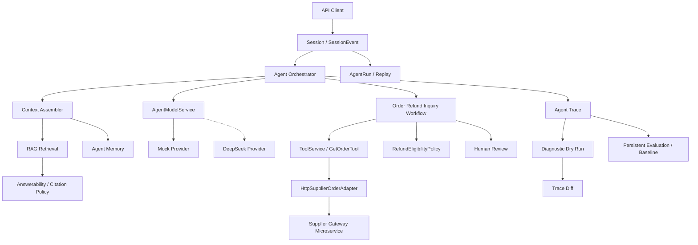

# TravelCare-Agent

TravelCare-Agent 是一个面向旅游退款客服场景的 **受控式（Controlled）AI Agent 业务后端系统**。项目采用 Spring Boot 3 + Java 17 进行模块化开发，围绕“订单退款咨询”场景构建可运行的 AI 客服闭环。

与传统的玩具级 Chatbot 或纯 LLM 规划的 Agent 不同，本项目践行 **“LLM 提议，后端验证、授权、执行、持久化并审计”** 的生产级架构原则，将 LLM 的意图理解能力与确定性工作流、高可靠异步处理、严格的安全权限和脱敏边界融为一体，特别适用于对资金安全、合规性要求极高的金融与交易场景。

---

## 核心系统特性

### 1. 受控式 Agent 与安全网关 (LLM Safety Gate)
- **输入输出收口**：采用统一的模型调用接口封装，支持底层不同大模型 Provider 的切换。
- **安全过滤拦截**：所有的 LLM 输出必须经过严格的结构化解析与 `ModelSafetyGate` 过滤，对于发现的伪造 Citation、敏感词、危险业务承诺或退款 Policy 冲突等情形，触发 `ALLOW`、`FALLBACK`、`BLOCK` 等安全策略。
- **只读工具限制**：仅允许 LLM 提议只读类工具（如订单查询），LLM 本身无权直接触发退款或资金划拨等副作用动作。

### 2. 确定性工作流引擎 (Deterministic Workflow Engine)
- **状态机控制**：退款资格判定、金额结算由确定性的退款政策规则引擎（`RefundEligibilityPolicy`）控制，LLM 仅负责结果解释与客服话术润色，不得干预退款资格结论。
- **任务推进与持久化**：工作流的所有步骤（Workflow Steps）与后台任务（Workflow Tasks）持久化落库，支持暂停、异常恢复及人工介入接管。

### 3. 可靠性设计与异步可靠投递 (Reliability & Outbox)
- **事务性发件箱模式 (Transactional Outbox)**：主业务操作与事件发布同事务落库，通过 `outbox_events` 保证消息队列（RabbitMQ）投递的可靠性，引入发布确认机制，避免消息丢失。
- **死信队列 (DLQ)**：对毒信及消费失败的消息，设置单独的死信交换机和死信队列进行安全拦截与审计。
- **外部调用对账与幂等**：对所有外部接口调用（如供应商、支付）实施严格的幂等控制。引入状态未知（`UNKNOWN`）超时处理与对账调度器，避免网络抖动导致重复退款或资金偏差。

### 4. 供应商网关隔离与可靠性 (Supplier Gateway Reliability)
- **微服务级隔离**：独立出专门的 `supplier-gateway` 微服务模拟外部供应商接口，规避主业务受供应商故障影响。
- **异常分类映射**：主应用引入可靠的远程网络适配，将供应商技术错误（超时、不可用、协议异常）精确映射为 `SupplierFailureCode`。
- **监控与健康度**：记录请求时长与失败率等低基数指标，并实现 `SupplierGatewayHealthIndicator` 进行健康度诊断。

### 5. 坐席人工接管与结构化上下文 (Structured Human Handoff)
- **结构化上下文包**：触发人工客服介入时，系统自动持久化生成结构化 `HumanHandoffContextPacket`，内含客户诉求、已校核订单事实、推荐操作和知识引用，告别杂乱的历史会话拼接，提升人机协同效率。
- **历史数据兼容**：提供旧数据 Fallback 策略，在缺失执行上下文时，自动从持久化事实源中动态拼装最小还原上下文。

### 6. 数据防泄露与全路径脱敏 (DLP & Redaction)
- **敏感正则收口**：在 `RedactionService` 中统一收口所有手机号、身份证、Bearer token、JWT 及 API-Key 等敏感正则过滤规则。
- **读取边界动态脱敏**：在用户或审计人员查询 Trace 链路和诊断快照时，在 API 读取边界进行在体动态脱敏，确保数据不落盘、不出域。
- **日志与异常脱敏**：自定义 Logback 的 MessageConverter 实现控制台日志输出正则过滤，并在 MDC 和全局异常处理器（`GlobalExceptionHandler`）中预先拦截并截断敏感信息。

### 7. 诊断追踪与仿真 (Agent Trace & Dry-Run)
- **全链路追踪**：详细记录一次 Agent 请求中的 Run、Span、Event 和业务数据快照。
- **无副作用空跑仿真**：基于 Trace 诊断快照进行 Dry-Run 仿真测试，使用 Mock 的外部适配和 LLM Snapshot 还原请求，在不产生任何实际业务数据与网络调用的前提下检验代码修改影响。
- **配置差异化比对**：支持运行后的 Trace Diff 分析，识别不同代码版本或 Prompt 下的策略变化与安全风险等级。

### 8. 离线自动化评测 (Offline Evaluation)
- **数据集管理**：评测集支持版本控制与激活策略。
- **自定义 Scorer**：评测机制覆盖 Policy 决策、RAG Citation 可回答性、越权工具使用等多个 Scorer 维度，支持运行报告导出与 Baseline 回归分析，阻断模型回复退化风险。

---

## 核心业务链路图



---

## 技术栈

- **核心框架**：Spring Boot 3.3.4, Spring Security, Spring Actuator, Spring AI (1.0.0-M5)
- **ORM & 数据库**：MyBatis-Plus, MySQL 8, Flyway
- **中间件**：Redis, RabbitMQ
- **监控可观测性**：Micrometer (低基数监控指标), Logback (带脱敏 MessageConverter)
- **测试与评测**：JUnit 5, Spring Boot Test, Mockito

---

## 项目主要 API 接口

### 会话与工作流 API
- `POST /api/sessions` : 创建新会话
- `POST /api/sessions/{sessionId}/messages` : 发送会话消息（支持同步/异步模式）
- `GET  /api/sessions/{sessionId}/events` : 获取会话历史事件流
- `GET  /api/sessions/{sessionId}/workflows` : 获取会话关联的工作流状态

### 知识检索与人机协作 API
- `POST /api/knowledge/documents` : 导入 SOP / 政策文档
- `GET  /api/knowledge/search` : 知识库 Fulltext 检索
- `GET  /api/human-review/cases` : 查询待复核的人工案件
- `POST /api/human-review/cases/{caseId}/resolve` : 客服处理人工接管案件并恢复工作流

### 诊断追踪与 AgentOps
- `GET  /api/agent-traces/{traceId}` : 获取全链路 trace 追踪
- `POST /api/agent-traces/{traceId}/dry-run` : 对 Trace 运行无副作用的仿真测试
- `GET  /api/agent-traces/{traceId}/diffs/{dryRunTraceId}` : 仿真运行与原始运行的差异比对
- `POST /api/agentops/debug/qa` : 针对 Trace 进行下钻调试分析

---

## 本地运行

### 1. 环境准备
- **Java**: JDK 17
- **本地服务**: 启动 MySQL、Redis 及 RabbitMQ 依赖。

可使用本地 Docker 快速拉起运行依赖：
```powershell
docker compose -f travelcare_dev/docker-compose.yaml up -d
```

### 2. 启动应用
**启动主应用**:
```powershell
.\mvnw.cmd spring-boot:run
```

**启动供应商网关独立微服务 (Http Supplier mode)**:
```powershell
cd supplier-gateway
.\mvnw.cmd spring-boot:run
```

### 3. 测试与验证
运行项目全部的单元与集成测试：
```powershell
.\mvnw.cmd test
```

> **注意**：测试在 Surefire 配置中固定使用 `travelcare.agent.provider=mock`，不消耗任何真实的 LLM Token，且运行不产生外部网络副作用。

---

## 演示 Demo 快速上手 (5分钟)

主应用及外部依赖正常启动后（使用 Mock Chat Provider），可执行以下流程快速验证：

1. **创建会话**
```http
POST /api/sessions
Content-Type: application/json

{"userId":1001,"channel":"WEB"}
```

2. **发送咨询消息（例如：Can I refund order ORD-1001?）**
```http
POST /api/sessions/{sessionId}/messages
Content-Type: application/json

{"content":"Can I refund order ORD-1001?","idempotencyKey":"demo-001","async":false}
```

3. **下钻链路诊断**
通过响应中的 `traceId` 钻取查看系统的执行过程：
```http
GET  /api/agent-traces/{traceId}
GET  /api/agent-traces/{traceId}/diagnostics
```

4. **无副作用空跑与比对**
```http
POST /api/agent-traces/{traceId}/dry-run
Content-Type: application/json

{"reason":"five-minute-demo","providerMode":"mock","compareAfterRun":true}
```
从 Dry-Run 响应中获取 `dryRunTraceId`，然后执行 Diff 对比：
```http
GET /api/agent-traces/{traceId}/diffs/{dryRunTraceId}
```

---

## 目录结构说明

```text
src/main/java/travelcare_agent/
├── conversation/   # 会话及事件状态处理
├── agent/          # Agent 编排 (Orchestrator)、安全网关 (ModelSafetyGate)
├── workflow/       # 状态机工作流引擎及任务调度 (Worker)
├── tool/           # 工具接口注册、调用与幂等过滤
├── retrieval/      # RAG 知识库检索与文档导入
├── answerability/  # Citation 引用策略与可回答性网关
├── memory/         # 用户长期记忆与行程缓存
├── agentrun/       # 模型调用 (AgentRun) 与事实 Replay 模块
├── trace/          # Span、Event 追踪及数据快照 (Snapshot)
├── dryrun/         # Trace 快照仿真运行与 Trace Diff 模块
├── evaluation/     # 离线评测用例集、自定义 Scorer 规则与 Baseline 基线
├── human/          # 转人工客服派单及 Handoff Context Packet 组装
├── audit/          # 敏感路径 append-only 审计日志
└── api/            # 控制器层暴露的 RESTful 接口
```
